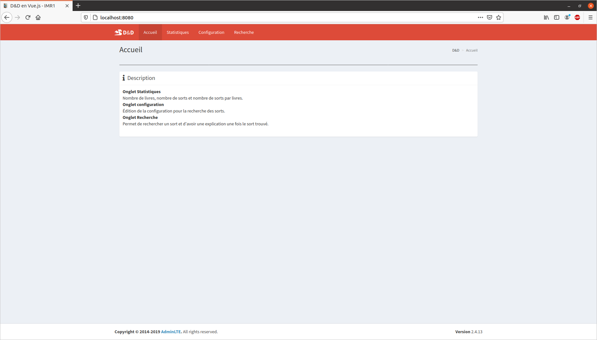

# [IMR1] Projet 2021 de Vue.js du module TechnologiesWeb.

> TP Vue.js IMR1 2021, Pierre-Yves GUENNOC

## Rendu



## Configuration de la construction

``` bash
# install dependencies
npm install

# serve with hot reload at localhost:8080
npm run dev

# build for production with minification
npm run build

# build for production and view the bundle analyzer report
npm run build --report
```

For a detailed explanation on how things work, check out the [guide](http://vuejs-templates.github.io/webpack/) and [docs for vue-loader](http://vuejs.github.io/vue-loader).
